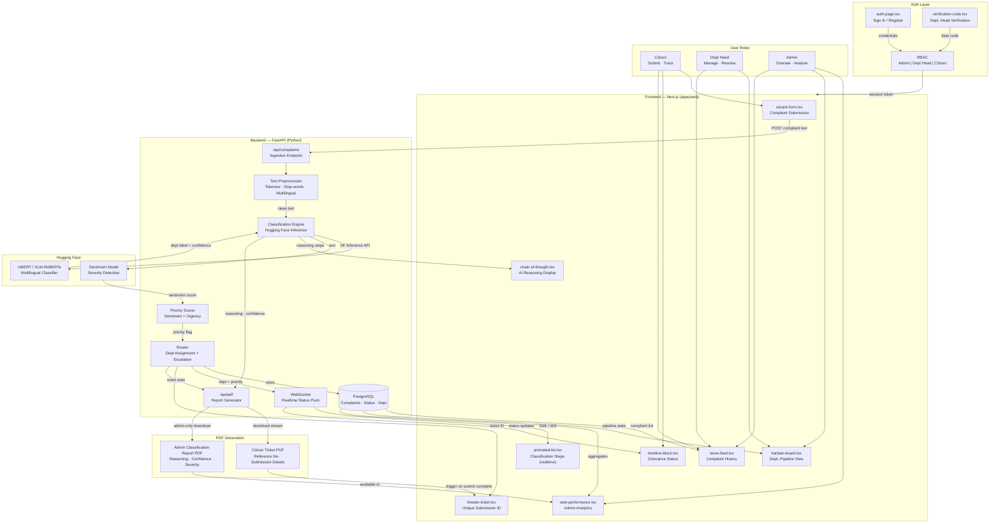

# System Architecture — AI Citizen Grievance Classification

```mermaid
flowchart TD
    subgraph CLIENT["Frontend — Next.js (apps/web)"]
        direction TB
        WF["wizard-form.tsx\nComplaint Submission"]
        AL["animated-list.tsx\nClassification Steps (realtime)"]
        TT["theater-ticket.tsx\nUnique Submission ID"]
        NF["news-feed.tsx\nComplaint History"]
        KB["kanban-board.tsx\nDept. Pipeline View"]
        TL["timeline-block.tsx\nGrievance Status"]
        WP["web-performance.tsx\nAdmin Analytics"]
        COT["chain-of-thought.tsx\nAI Reasoning Display"]
    end

    subgraph AUTH["Auth Layer"]
        AP["auth-page.tsx\nSign In / Register"]
        VC["verification-code.tsx\nDept. Head Verification"]
        RBAC["RBAC\nAdmin | Dept Head | Citizen"]
    end

    subgraph BACKEND["Backend — FastAPI (Python)"]
        direction TB
        ING["/api/complaints\nIngestion Endpoint"]
        PROC["Text Preprocessor\nTokenize · Stop-words · Multilingual"]
        CLASS["Classification Engine\nHugging Face Inference"]
        PRIO["Priority Scorer\nSentiment + Urgency"]
        ROUTE["Router\nDept Assignment + Escalation"]
        DB[("PostgreSQL\nComplaints · Status · Dept")]
        WS["WebSocket\nRealtime Status Push"]
        PDFGEN["/api/pdf\nReport Generator"]
    end

    subgraph PDF["PDF Generation"]
        TICKETPDF["Citizen Ticket PDF\nReference No · Submission Details"]
        CLASSPDF["Admin Classification Report PDF\nReasoning · Confidence · Severity"]
    end

    subgraph HF["Hugging Face"]
        BERT["mBERT / XLM-RoBERTa\nMultilingual Classifier"]
        SENT["Sentiment Model\nSeverity Detection"]
    end

    subgraph ROLES["User Roles"]
        CITIZEN["Citizen\nSubmit · Track"]
        DEPTHEAD["Dept Head\nManage · Resolve"]
        ADMIN["Admin\nOversee · Analyse"]
    end

    %% Auth flow
    AP -->|"credentials"| RBAC
    VC -->|"dept code"| RBAC
    RBAC -->|"session token"| CLIENT

    %% Submission flow
    WF -->|"POST complaint text"| ING
    ING --> PROC
    PROC -->|"clean text"| CLASS
    CLASS -->|"HF Inference API"| BERT
    BERT -->|"dept label + confidence"| CLASS
    CLASS -->|"text"| SENT
    SENT -->|"sentiment score"| PRIO
    PRIO -->|"priority flag"| ROUTE
    ROUTE -->|"store"| DB
    ROUTE -->|"dept + priority"| WS

    %% Realtime feedback
    WS -->|"SSE / WS"| AL
    WS -->|"status updates"| TL
    ROUTE -->|"ticket ID"| TT

    %% Dashboard data
    DB -->|"complaint list"| NF
    DB -->|"pipeline state"| KB
    DB -->|"aggregates"| WP

    %% AI reasoning display
    CLASS -->|"reasoning steps"| COT

    %% PDF flows
    ROUTE -->|"ticket data"| PDFGEN
    PDFGEN -->|"download stream"| TICKETPDF
    TICKETPDF -->|"trigger on submit complete"| TT
    CLASS -->|"reasoning · confidence"| PDFGEN
    PDFGEN -->|"admin-only download"| CLASSPDF
    CLASSPDF -->|"available in"| WP

    %% Role views
    CITIZEN --> WF
    CITIZEN --> TL
    CITIZEN --> NF
    DEPTHEAD --> KB
    DEPTHEAD --> NF
    ADMIN --> WP
    ADMIN --> KB
    ADMIN --> NF
```