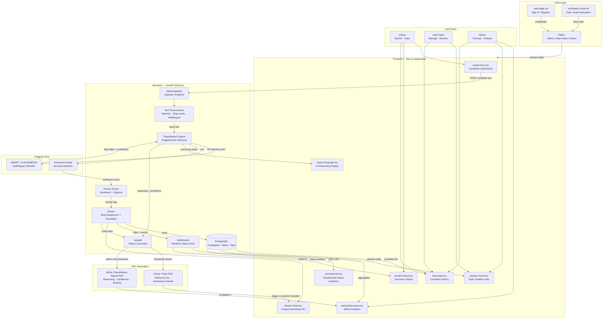

# System Architecture — AI Citizen Grievance Classification

## Data Flow Summary

| Step | Source | Sink | Protocol |
|------|--------|------|----------|
| 1. Submit | wizard-form | FastAPI `/api/complaints` | HTTP POST |
| 2. Preprocess | FastAPI | HF model | Internal |
| 3. Classify | HF mBERT/XLM-R | FastAPI | HF Inference API |
| 4. Priority | Sentiment model | FastAPI router | Internal |
| 5. Route | FastAPI | PostgreSQL + WebSocket | Internal |
| 6. Realtime | WebSocket | animated-list, timeline | WS/SSE |
| 7. Dashboard | PostgreSQL | news-feed, kanban, analytics | HTTP GET |
| 8a. Ticket PDF | FastAPI `/api/pdf/ticket` | Citizen browser (download) | HTTP GET, triggered at theater-ticket render |
| 8b. Classification PDF | FastAPI `/api/pdf/classification` | Admin browser (download) | HTTP GET, admin-only auth gate |

## Component–Route Mapping

| Component | Role | Route |
|-----------|------|-------|
| wizard-form | All | `/dashboard/submit` |
| theater-ticket | Citizen | Overlay after submit |
| timeline-block | Citizen | `/dashboard/track/:id` |
| news-feed | All (filtered) | `/dashboard/complaints` |
| kanban-board | Admin, Dept Head | `/dashboard/pipeline` |
| web-performance | Admin | `/dashboard` (default) |
| services-grid-block | Admin | `/dashboard/departments` |
| animated-list | All | Overlay during classification |
| chain-of-thought | All | Embedded in complaint detail |

## PDF Generation

| Type | Audience | Trigger | Content |
|------|----------|---------|---------|
| **Complaint Ticket** | Citizen | After classification completes at theater-ticket render | Reference number, submitted text, assigned department, priority level, submission timestamp |
| **Classification Report** | Admin only | Manual download from web-performance / interactive-logs-table per complaint | Full reasoning trace from chain-of-thought, model confidence scores, severity assessment from live-line, routing decision history |

Implementation in frontend: `apps/web/lib/pdf.ts` wraps `jspdf` for client-side rendering against mock data; once backend is live, swap to `/api/pdf/*` endpoints.
